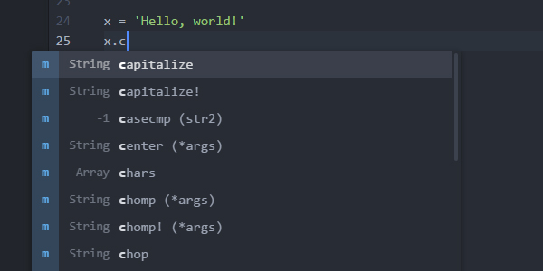

# ruby-solargraph

**This project has been archived.** See [the Solargraph gem repo](https://github.com/castwide/solargraph) for current information about the Solargraph gem and available extensions.

Ruby code completion and inline documentation.

## Features

* Context-aware suggestions and documentation for the Ruby core
* Detection of some variable types and method return values (e.g., `String.new.` returns String instance methods)
* Identification of local, class, and instance variables within the current scope

## Requirements

You need to install the Ruby gem:

    gem install solargraph

## Usage

### Code Completion

Open a Ruby file and start typing. Solargraph should start providing contextual code suggestions. To start a search manually, hit ctrl-space. Example:

    Stri # <- Hitting ctrl-space here will suggest String

Method arguments and documentation can be seen by starting parentheses after the method call. Example:

    String.new.casecmp( # <- Displays arguments and documentation for String#casecmp

### Documenting Your Code

Using [YARD](http://www.rubydoc.info/gems/yard/file/docs/GettingStarted.md) for inline documentation is highly recommended.
Solargraph will use YARD comments to provide the best code completion and API reference it can.

In addition to the standard YARD tags, Solargraph defines a `@type` tag for documenting variable types. It works with both
local and instance variables. Example:

    # @type [String]
    my_variable = some_method_call
    my_variable. # <= Hitting crtl-space here will suggest String instance methods

## Configuration

* `commandPath`: The path to the `solargraph` executable.
